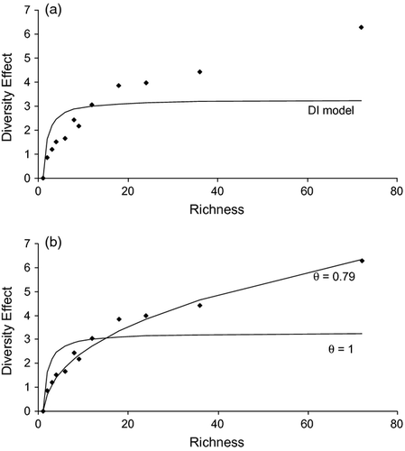

```{css styling, echo=FALSE}
span.R {
  font-family: Courier New;
}
```

```{r, include = FALSE}
knitr::opts_chunk$set(
  collapse = TRUE,
  comment = "#>"
)

options(crayon.enabled = TRUE)

ansi_aware_handler <- function(x, options)
{
  paste0(
    "<pre class=\"r-output\"><code>",
    fansi::sgr_to_html(x = x, warn = FALSE, term.cap = "256"),
    "</code></pre>"
  )
}

old_hooks <- fansi::set_knit_hooks(knitr::knit_hooks,
                                 which = c("output", "message", "error", "warning"))
knitr::knit_hooks$set(
  output = ansi_aware_handler,
  message = ansi_aware_handler,
  warning = ansi_aware_handler,
  error = ansi_aware_handler
)
```

```{r setup}
library(DImodelsMulti)
library(DImodels)
```

<h2>A quick overview</h2>

The main function of the R package <span class="R">DImodelsMulti</span> is <span class="R">DImulti()</span>. It is designed to fit (1) multivariate Diversity-Interactions (DI) 
models (Dooley *et al.*, 2015), (2) repeated measures DI models (Finn *et al.*, 2013), and (3) multivariate repeated measures DI models.

An example of a multivariate repeated measures DI model can be seen below:

$$ y_{kmt} =  \sum^{S}_{i=1}{\beta_{ikt} p_{im}} +
 \sum^{S}_{\substack{i,j=1 \\ i<j}}{\delta_{ijkt}(p_{im}p_{jm})^{\theta_{k}}} +
 \epsilon_{kmt} $$
 
where $y_{kmt}$ refers to the value of the $k^{th}$ ecosystem function from the
$m^{th}$ experimental unit at a time point $t$. For an experimental unit $m$, $\beta_{ikt}$ scaled 
by $p_{im}$ is the expected contribution of the $i^{th}$  species to the $k^{th}$ response at time 
point $t$ and is referred to as the $i^{th}$ species’ ID effect.
$S$ represents the number of unique species present in the study. Similarly to the ID effect,
the interaction effect, $\delta$, between species is scaled by some combination of the products 
of species proportions, which depends on the interaction structure chosen. The example above shows 
the full pairwise structure, which has a unique interaction term, $\delta_{ij}$, per pair of species $i$ & $j$. 

The nonlinear term $\theta$ (Connolly *et al.*, 2013; Vishwakarma *et al.*, 2023), the focus of this vignette, is applied as a power to each pair of species proportions included in the interaction terms of the model. It is included in the model to allow the shape of the BEF relationship to change. 
The value of the nonlinear parameter $\theta$ is allowed to vary between ecosystem functions, in 
turn allowing the fixed effect structure to change across functions, in recognition that the nature of the species interactions could change between ecosystem functions.


{width=100%}
Image Credit: Connolly *et al.* 2013


<h2>DImulti()'s estimation process for $\theta$ </h2>

In the function <span class="R">DImulti()</span>, $\theta$ values may be supplied by a user through 
the parameter <span class="R">'theta'</span> or estimated by specifying <span class="R">TRUE</span>
through <span class="R">'estimate_theta'</span>. The non-linear term may also be "left out" by 
setting <span class="R">'theta'</span> equal to 1 and <span class="R">'estimate_theta'</span> to 
FALSE, which is the default for the function.

```{r thetaOptions, eval = FALSE}
DImulti(..., theta = c(0.5, 1, 1.2))
DImulti(..., estimate_theta = TRUE)
DImulti(..., theta = 1, estimate_theta = FALSE)
```


Setting a value for theta supplied by a user is a straightforward process thanks to the function
<span class="R">DI_data()</span> from the parent package <span class="R">DImodels</span> (Moral *et al.*, 2023). We divide the dataset by ecosystem function, as multivariate data can have differing values of theta for each, then pass each subset into the function, specifying the desired $\theta$ value and base interaction structure. The subsets are then binded together again and the dataset is ready for use with theta. 

The below example would transform the usual format of a full pairwise structure from 
$\delta_{12}p_{1}p_{2} + \delta_{13}p_{1}p_{3} + \delta_{23}p_{2}p_{3}$ to $\delta_{12}(p_{1}p_{2})^{1.2} + \delta_{13}(p_{1}p_{3})^{1.2} + \delta_{23}(p_{2}p_{3})^{1.2}$.

```{r DI_data_value, eval = FALSE}
DI_data(..., theta = 1.2, what = "FULL")
```


When theta is estimated, the process is a bit more involved. We perform the same dataset separation 
by ecosystem function, then fit a univariate DI model (Kirwan *et al.*, 2009), ignoring any repeated measures, using the 
method <span class="R">DI()</span>, which is also available in the parent package <span class="R">DImodels</span> (Moral *et al.*, 2023). We specify that we wish to estimate theta and specify the interaction  structure desired. This method uses profile likelihood optimisation (Brent, 1973) to find the best fitting value of theta between $0.01$ and $1.5$. Finally, we can extract the coefficient theta from each of our returned models and then use these values as if the user specified them (see above for details).

```{r DI_estimate, eval = FALSE}
DI(..., estimate_theta = TRUE, DImodel = "FULL")$coefficients[["theta"]]
```


<h2>Implications of this methodology and suggestions </h2>

For multivariate and repeated measures DI models, we have allowed the value of theta to vary across ecosystem functions, which in turn allows the change in fixed effects structures to vary across functions. This is not common practice in multivariate regression and so its effects/implications will require further study.

The methodology used in this package involves estimating $\theta$ values separately for 
each ecosystem function, therefore estimates are each unaffected by the presence of other functions and values. The use of theta in the multivariate space is currently still being researched and so the effect of this method is unknown, but was chosen to minimise computational intensity. 

As each $\theta$ value is optimised for its ecosystem function isolated from other functions/values, it can occur that the function will encounter an error, most commonly a singular fit, when trying to model all functions together. In this event, the function will print the estimated $\theta$ values and it is recommended that they be slightly altered and passed through the function manually by the user rather than using <span class="R">'estimate_theta'</span>. It is also possible that the fixed effects structure, e.g. interaction structure choice or extra fixed effects added, may need to be changed as opposed to theta, therefore we recommend setting <span class="R">theta = 1</span> to select an appropriate fixed effect structure first before estimating theta (Vishwakarma *et al.*, 2023).

In the event that a user wishes to estimate a theta value for multiple ecosystem functions simultaneously, the code below can be used.

```{r optimTheta, eval = FALSE}
f <- function(theta_val) 
{
  fit <- DImulti(prop = 2:5, y = 6:8, eco_func = c("na", "un"), time = c("time", "ar1"),
                 unit_IDs = 1, theta = theta_val, DImodel = "FULL", method = "ML",
                 data = simMVRM)
  
	return(-as.numeric(logLik(fit)))
}
	
optim(c(1,1,1), f, hessian = FALSE, lower = c(.1,.1,.1), upper = c(1.5,1.5,1.5),
      method = "L-BFGS-B")
```

We create a function to fit multivariate repeated measures DI models, wrapping <span class="R">DImulti()</span>, which accepts a vector of theta values, one per ecosystem function, and returns the negative log likelihood of the produced model. We then use <span class="R">optim()</span> to minimise the returned value from this function over the space of the allowable values of theta.

The methodology used in this R package may change in future updates to align with research findings on the topic.

 


<h2>References</h2>

Vishwakarma, R., Byrne, L., Connolly, J., de Andrade Moral, R. and Brophy, C., 2023. 
Estimation of the non-linear parameter in Generalised Diversity-Interactions models is unaffected by change in structure of the interaction terms. 
Environmental and Ecological Statistics, 30(3), pp.555-574.  

Moral, R.A., Vishwakarma, R., Connolly, J., Byrne, L., Hurley, C., Finn, J.A. and Brophy, C.,
2023. 
Going beyond richness: Modelling the BEF relationship using species identity, evenness,
richness and species interactions via the DImodels R package. 
Methods in Ecology and Evolution, 14(9), pp.2250-2258.  

Dooley, Á., Isbell, F., Kirwan, L., Connolly, J., Finn, J.A. and Brophy, C., 2015. 
Testing the effects of diversity on ecosystem multifunctionality using a multivariate model. 
Ecology Letters, 18(11), pp.1242-1251.  

Finn, J.A., Kirwan, L., Connolly, J., Sebastià, M.T., Helgadottir, A., Baadshaug, O.H.,
Bélanger, G., Black, A., Brophy, C., Collins, R.P. and Čop, J., 2013. 
Ecosystem function enhanced by combining four functional types of plant species in intensively
managed grassland mixtures: a 3‐year continental‐scale field experiment.
Journal of Applied Ecology, 50(2), pp.365-375 . 

Connolly, J., Bell, T., Bolger, T., Brophy, C., Carnus, T., Finn, J.A., Kirwan, L., Isbell, F.,
Levine, J., Lüscher, A. and Picasso, V., 2013. 
An improved model to predict the effects of changing biodiversity levels on ecosystem function.

Journal of Ecology, 101(2), pp.344-355.  

Kirwan, L., Connolly, J., Finn, J.A., Brophy, C., Lüscher, A., Nyfeler, D. and Sebastià, M.T.,
2009. 
Diversity-interaction modeling: estimating contributions of species identities and interactions
to ecosystem function. 
Ecology, 90(8), pp.2032-2038.  

Brent, R.P., 1973. 
Some efficient algorithms for solving systems of nonlinear equations. 
SIAM Journal on Numerical Analysis, 10(2), pp.327-344.
