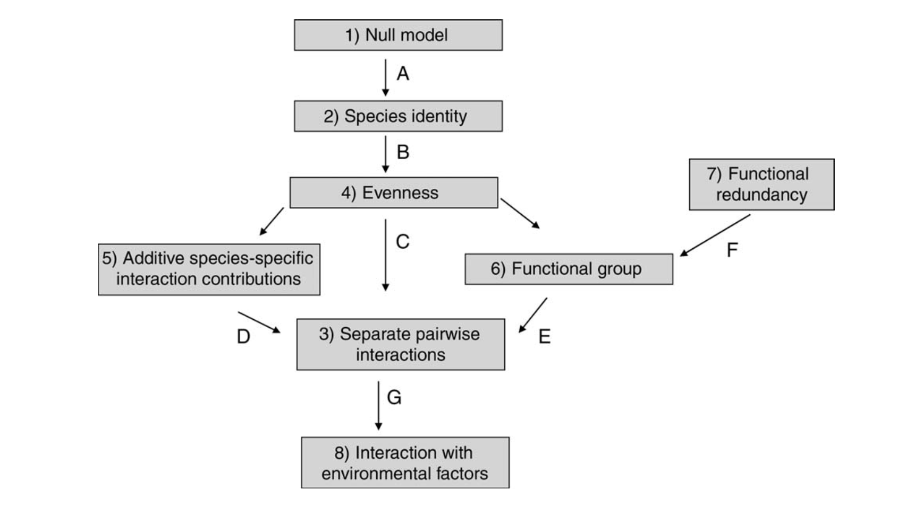

```{css styling, echo=FALSE}
span.R {
  font-family: Courier New;
}
```

```{r, include=FALSE}
knitr::opts_chunk$set(
  collapse = TRUE,
  comment = "#>"
)

options(crayon.enabled = TRUE)

ansi_aware_handler <- function(x, options)
{
  paste0(
    "<pre class=\"r-output\"><code>",
    fansi::sgr_to_html(x = x, warn = FALSE, term.cap = "256"),
    "</code></pre>"
  )
}

old_hooks <- fansi::set_knit_hooks(knitr::knit_hooks,
                                 which = c("output", "message", "error", "warning"))
knitr::knit_hooks$set(
  output = ansi_aware_handler,
  message = ansi_aware_handler,
  warning = ansi_aware_handler,
  error = ansi_aware_handler
)
```

```{r setup, message=FALSE, warning=FALSE}
library(DImodelsMulti)
library(dplyr)
library(nlme)
library(ggplot2)
```

This vignette aims to give a rough outline for the process to be followed when examining 
multivariate and/or repeated measures BEF relationship study data using the 
<span class="R">DImulti()</span> function from the <span class="R">DImodelsMulti</span> R package.

We will use the dataset <span class="R">simMVRM</span>, which is included in the package, to 
illustrate the workflow of the package.

<h2>Examining the data</h2>

We always start by looking at our data using <span class="R">View()</span> or 
<span class="R">head()</span>, to make sure it is as expected and includes all required information.
```{r data_head}
head(simMVRM)
```

We can then look at some summarising metrics, such as the mean of each ecosystem function, 
separated by time as below, which can help us know what to expect in the analysis, in this case
we see that ecosystem functioning improves at time point 2 for the average multifunctionality index,
<span class="R">MFindex</span>, but the function <span class"R">Y2</span> performs better at time 
1.
```{r data_group}
simMVRM_group <-  dplyr::summarise(dplyr::group_by(simMVRM, time),
                                   Y1 = mean(Y1),
                                   Y2 = mean(Y2),
                                   Y3 = mean(Y3),
                                   MFindex = mean(Y1 + Y2 + Y3))
simMVRM_group
```

We can also produce plots to the same effect.
```{r data_hist, out.width="75%", fig.alt="A histogram of the raw data"}
hist(simMVRM[which(simMVRM$time == 1), ]$Y1, main = "Y1 at time 1", xlab = "Y1")
```


<h2>Fitting the first model</h2>

We use the main function of the <span class="R">DImodelsMulti</span> R package, 
<span class="R">DImulti()</span>, to fit a repeated measures Diversity-Interactions model to the 
data.

It is recommended to begin with the simplest model options and increase complexity as model 
selection/comparisons permit. The simplest model available to be fit by the package is the 
structural model, <span class="R">"STR"</span>, which only includes an intercept for each time and 
ecosystem function.
$$ y_{kmt} =  \beta_{0kt} + \epsilon_{kmt} $$
```{r DImulti_modelSTR}
modelSTR <- DImulti(y = c("Y1", "Y2", "Y3"), eco_func = c("NA", "UN"), time = c("time", "CS"),
                    unit_IDs = 1, prop = 2:5, data = simMVRM, DImodel = "STR", method = "ML")
```
As our dataset is multivariate and in a wide format, we specify our response columns through the 
parameter <span class="R">y</span>, "NA" through the first index of the vector 
<span class="R">eco_func</span>, and select the unstructured (<span class="R">"UN"</span>) 
autocorrelation structure for our ecosystem functions through the second index of 
<span class="R">eco_func</span>. The data also contains multiple time points, so we pass the column
holding the time point indicator through the parameter <span class="R">time</span>, along with the
chosen autocorrelation structure, in this case we use compound symmetry, 
<span class="R">"CS"</span>. To facilitate grouping the recorded responses, a column index for the 
unique identifier of the experimental units is passed through <span class="R">unit_IDs</span>. We 
choose to use the maximum likelihood (<span class="R">"ML"</span>) estimation method as we intend to
compare models with differing fixed effects.

We can use <span class="R">print()</span> or <span class="R">summary()</span> to view information 
on the model in our console.
```{r DImulti_modelSTR_print}
print(modelSTR)
```
From this evaluation, we can see that each of our coefficients are significant at an alpha 
significance level of 0.05 ($\alpha = 0.05$). We can also see the variance covariance matrices for
our repeated measures and multiple ecosystem functions, along with the combined matrix, from which 
we can see the estimated strength and direction of the covarying relationships between response 
types.

<h2>Fitting a Diversity-Interactions model</h2>

The next model to be fit is the simplest Diversity-Interactions (DI) model available in the package,
the identity (<span class="R">"ID"</span>) structure.
$$ y_{kmt} =  \sum^{S}_{i=1}{\beta_{ikt} p_{im}} + \epsilon_{kmt} $$
The DI modelling framework assumes that the main driver behind changes in ecosystem functioning is
the initial relative abundance/proportion of the species.To reflect this, the intercept from the 
structural model we fit previously is replaced by the initial proportion of the species in the 
study, each with their own $\beta$ coefficient. These fixed effects form a simplex space. The only
code that we need to change for this model is the <span class="R">DImodel</span> tag, from <span class="R">"STR"</span> to <span class="R">"ID"</span>.
```{r DImulti_modelID}
modelID <- DImulti(y = c("Y1", "Y2", "Y3"), eco_func = c("NA", "UN"), time = c("time", "CS"),
                    unit_IDs = 1, prop = 2:5, data = simMVRM, DImodel = "ID", method = "ML")
```
We can now view this model, as before. In this case, we simply extract the t-table from the model 
summary.
```{r DImulti_modelID_tTable}
summary(modelID)$tTable
```

The models within the DI modelling framework can be easily compared as they are hierarchical in 
nature, i.e. they are nested within one another. We can compare nested models using a likelihood 
ratio test, through <span class="R">anova()</span>, or information criteria, such as 
<span class="R">AIC()</span> or <span class="R">BIC()</span> (the correct versions of which, 
<span class="R">AICc()</span> or <span class="R">BICc()</span> should be used in the cased of 
models with a large number of terms).

{width=100%}
Image Credit: Kirwan *et al.* 2009

We choose to compare these models using a likelihood ratio test, where the null hypothesis states
that the likelihoods of the two models do not significantly differ from one another, i.e. the extra
terms in our larger model are not worth the added complexity.
```{r DImulti_STR_ID_LRT}
anova(modelSTR, modelID)
```
As the p-value of the test is less than our chosen $\alpha$ value of 0.05, we reject the null 
hypothesis and proceed with the more complex model. We can confirm this selection by choosing the
model with the lower AIC and BIC values, which are also printed by the 
<span class="R">anova()</span> call.


<h2>Fitting and comparing interactions structures</h2>

We continue to increase the complexity of the models by fitting the next interaction structure in
the nesting series, the average interaction model, <span class="R">"AV"</span>, a 
reparameterisation of the evenness model, <span class="R">"E"</span>. Again, the only code change 
required is the change of the <span class="R">DImodel</span> tag. We then compare the two models.
```{r DImulti_modelAV}
modelAV <- DImulti(y = c("Y1", "Y2", "Y3"), eco_func = c("NA", "UN"), time = c("time", "CS"),
                    unit_IDs = 1, prop = 2:5, data = simMVRM, DImodel = "AV", method = "ML")

coef(modelAV)
anova(modelID, modelAV)
```
Once again, as our p-value < 0.05, we select the more complex model and continue increasing 
complexity.

<h3>Estimating theta</h3>

Now that we are fitting interactions, we may elect to estimate the non-linear
parameter $\theta$, see vignette [onTheta](DImulti_onTheta.html) for a more in depth look at this 
process. We include the parameter <span class="R">estimate_theta</span> with argument 
<span class="R">TRUE</span> to have <span class="R">DImulti()</span> automatically fit and compare 
different values of $\theta$, or if a user has *a priori* information on the nature of the term, 
they may pass values through the parameter <span class="R">theta</span>. We can then test the two
models against one another using information criteria, to see if the theta values significantly differ from 1.
```{r DImulti_modelAV_theta}
modelAV_theta <- DImulti(y = c("Y1", "Y2", "Y3"), eco_func = c("NA", "UN"), time = c("time", "CS"),
                    unit_IDs = 1, prop = 2:5, data = simMVRM, DImodel = "AV", method = "ML",
                    estimate_theta = TRUE)

thetaVals <- modelAV_theta$theta
thetaVals

AICc(modelAV) 
AICc(modelAV_theta)
```
In this case, the inclusion of theta does improve the model.

The next models in the series are not nested within one another, so either can be used next but they
cannot be compared to one another using a likelihood ratio test. As this dataset was simulated
without any functional groupings, i.e. any groupings would be arbitrary, we choose to fit the 
additive interaction structure, <span class="R">"ADD"</span>.

```{r DImulti_modelADD}
modelADD <- DImulti(y = c("Y1", "Y2", "Y3"), eco_func = c("NA", "UN"), time = c("time", "CS"),
                    unit_IDs = 1, prop = 2:5, data = simMVRM, DImodel = "ADD", method = "ML",
                    theta = thetaVals)

modelADD$coefficients
anova(modelAV_theta, modelADD)
```
In this case, the p-value is greater than our chosen alpha level of 0.05, therefore we fail to
reject the null hypothesis that the added complexity of the model does not significantly increase 
the model likelihood, and proceed in our analysis with the simpler model, 
<span class="R">modelAV</span>.

As we do not need to increase the complexity of the model through the interaction structures any 
further, we turn to other options. It is at this stage that one could introduce treatment effects or
environmental variables. As the <span class="R">simMVRM</span> dataset does not contain any such 
information, example code is included below, where model <span class="R">modelAV_treat1</span> 
includes an intercept for <span class="R">treat</span> for each level of ecosystem function and time point, while <span class="R">modelAV_treat2</span> crosses <span class="R">treat</span> with each other 
fixed effect term.
```{r DImulti_modelADD_treat, eval=FALSE}
modelAV_treat1 <- DImulti(y = c("Y1", "Y2", "Y3"), eco_func = c("NA", "UN"), time = c("time", "CS"),
                    unit_IDs = 1, prop = 2:5, data = simMVRM, DImodel = "ADD", method = "ML",
                    theta = thetaVals, extra_fixed = ~treat)

modelAV_treat2 <- DImulti(y = c("Y1", "Y2", "Y3"), eco_func = c("NA", "UN"), time = c("time", "CS"),
                    unit_IDs = 1, prop = 2:5, data = simMVRM, DImodel = "ADD", method = "ML",
                    theta = thetaVals, extra_fixed = ~1:treat)
```

The model could also alternatively be simplified here, by adding ID grouping, i.e. introducing 
functional redundancy within species ID effects. As <span class="R">simMVRM</span> is simulated with
no ID grouping in mind, any groups selected would be arbitrary and thus not recommended, however,
example code for doing so is included below. These groupings do not affect the interaction term(s).
```{r DImulti_modelAV_ID}
modelAV_ID <- DImulti(y = c("Y1", "Y2", "Y3"), eco_func = c("NA", "UN"), time = c("time", "CS"),
                    unit_IDs = 1, prop = 2:5, data = simMVRM, DImodel = "AV", method = "ML",
                    theta = thetaVals, ID = c("Group1", "Group1", "Group2", "Group2"))

summary(modelAV_ID)$tTable
anova(modelAV_ID, modelAV)
```
As the p-value is lower than 0.05, we reject the null hypothesis and continue with the more complex
model, without any ID groupings.


If any errors are encountered in the process of fitting these models, please see vignette 
[commonErrors](DImulti_commonErrors.html) for a guide.

<h2>Final model</h2>

As we have concluded our model selection process, the final step before interpretation is to refit 
the chosen model design using the method <span class="R">"REML"</span>, for unbiased estimates.
```{r DImulti_modelFinal}
modelFinal <- DImulti(y = c("Y1", "Y2", "Y3"), eco_func = c("NA", "UN"), time = c("time", "CS"),
                    unit_IDs = 1, prop = 2:5, data = simMVRM, DImodel = "AV", method = "REML",
                    theta = thetaVals)

summary(modelFinal)
```


<h2>Interpretation</h2>

The final and most important step in the workflow of any analysis is the interpretation of the final
model. 

We first look at the fixed effect coefficients, their significance and direction. For example, we
can see that the identity effect of species <span class="R">p1</span> has a significant, negative 
effect on ecosystem function <span class="R">Y1</span> at time point <span class="R">1</span>, but 
a significant positive effect on ecosystem function <span class="R">Y3</span> at the same time 
point. We can also see that the interaction effect <span class="R">AV</span> has a significant 
positive effect on all ecosystem functions at both time points. As this interaction term is 
maxmimised in an ecosystem design where all four species are represented evenly, it may be 
beneficial to include species <span class="R">p1</span> despite its negative effect on 
<span class="R">Y1</span>, the presence of other species, which have a positive effect on this
ecosystem function could also 'make up' for this fault of species <span class="R">p1</span> 
(assuming that our goal is the maximisation of all ecosystem functions).
```{r DImulti_modelFinal_tTable}
summary(modelFinal)$tTable
```

Next we could examine the variance covariance matrices of the model. These can be extracted from 
the model by either using the function <span class="R">getVarCov()</span> from the R package
<span class="R">nlme</span> or by using the <span class="R">$</span> operator (the components of a
model in R can be viewed using <span class="R">View(model)</span>). 
```{r DImulti_modelFinal_varCovs, eval=FALSE}
nlme::getVarCov(modelFinal)

modelFinal$vcov
```
```{r DImulti_modelFinal_getVarCov, echo=FALSE}
nlme::getVarCov(modelFinal)
```

An example of an interpretation that we can make from these variance covariance matrices, is that 
the ecosystem functions <span class="R">Y1</span> and <span class="R">Y3</span> are negatively correlated, therefore would likely result in trade-offs when trying to maximise one over the other.


As multivariate repeated measures DI models can contain a large number of fixed effects, they can be
difficult to interpret from. Our suggestion to circumvent this issue is to first predict from the 
model for community designs of interest, using the predict() function, as seen below, see vignette 
[prediction](DImulti_prediction.html) for further details on this.
```{r DImulti_modelFinal_predict}
comms <- simMVRM[c(1, 4, 7, 10, 21), ]
print(comms)


commPred <- predict(modelFinal, newdata = comms)
commPred
```
Then, with these predictions, we can employ summarising metrics, such as a multifunctionality index,
to summarise our findings while maintaining the benefits of having modelled each ecosystem function
separately but simultaneously, alla Suter *et al* 2021. We could also use these predictions to 
generate a plot/graph to display our findings, such as a histogram, grouped bar chart, or 
ternary diagram.
```{r DImulti_modelFinal_grouped, out.width="75%", fig.alt="An example histogram"}
ggplot2::ggplot(commPred, ggplot2::aes(fill=Ytype, y=Yvalue, x=plot)) +
  ggplot2::geom_bar(position="dodge", stat="identity")
```

The R package, <span class="R">DImodelsVis</span>, is available on CRAN and makes plotting
DI models fit using the R packages <span class="R">DImodels</span> or 
<span class="R">DImodelsMulti</span> a simple process.


<h2>References</h2>

Suter, M., Huguenin-Elie, O. and Lüscher, A., 2021.
Multispecies for multifunctions: combining four complementary species enhances multifunctionality of 
sown grassland.
Scientific Reports, 11(1), p.3835.

Kirwan, L., Connolly, J., Finn, J.A., Brophy, C., Lüscher, A., Nyfeler, D. and Sebastià, M.T.,
2009.
Diversity-interaction modeling: estimating contributions of species identities and interactions
to ecosystem function.
Ecology, 90(8), pp.2032-2038.

